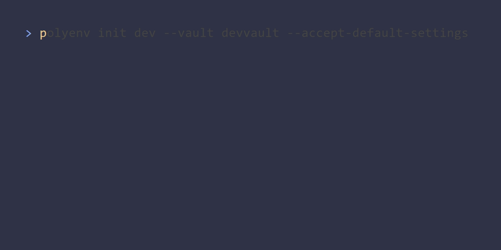

# polyenv


[](https://opensource.org/licenses/MPL-2.0)

polyenv is a CLI tool that allows you to manage secrets in your environment and show values from multiple env files

no hidden solution, no monthlye fees, no subscriptions. just a simple CLI tool that you can use to pull secrets from your already defined enterprise vaults or secret managers.

## Features

- Config file so everyone share the same secret-sources. this can be used with your git repo.
- Pull secrets from a selection of remote vaults
  - Only Keyvault and local cred store atm. see [main issue](https://github.com/WithHolm/polyenv/issues/56) to see a list of other sources that are in the pipeline
- Load values from multiple env files within the same environment.
- no subscriptions, no hidden solution, no monthly fees. just a simple cli tool, available everywhere.

## Installation

### [LATEST RELEASE]([https://](https://github.com/WithHolm/polyenv/releases/tag/latest))

### [DEV RELEASE]([https://](https://github.com/WithHolm/polyenv/releases/tag/nightly))

## Usage

- Note: this is a work in progress.
- Also note: I will reference `{env}` as the name of the environment you are using, but you can also use "none" environment referencing `.env` file. in these cases, for all examples you may omit the `{env}` part.

### Initialize a new environment

it will ask you to add vaults and secrets:

- `polyenv init`: Asks you to select vault and secret
- `polyenv init --type {vaultType}`: Initializes the environment with the given [vault type](#supported-vaults)
- `polyenv init --type {vaultType} --arg key=value`: Initializes the environment with the given [vault type](#supported-vaults) and sets the given arguments set dotenv style

in all cases it will create a `{env}.polyenv.toml` file in the current directory. This file can be moved anywhere within your repo.  
this will also be true for any env files. it uses git root (if present) and searches downwards for any `.env` file.


When this is done, you can use `polyenv !{env}` to show what commands are available to manage this environment. or you can use `polyenv status` to show the current status of all environments.

### Add vault or secret

- `polyenv !{env} add vault`: Adds a new vault to the environment.
- `polyenv !{env} add secret [vault name]`: Adds a new secret to the environment

adding vault


adding secret


### Pull secrets from vault

depending on your [config](#polyenv-config), this will either set secrets in `.env.secrets.{env}` file or existing uinqe keys in existing `{env}.env||.env.{env}` files

- `polyenv !{env} pull`

#### Export to ci or out

`polyenv !{env} export`  
by it will output a list of all env keys in the current environment and wether they could be secrets by detecting the value and key, if no options are provided.

you have the ability to select export format and destination:

- formatters: `json`, `jsonArr`, `azdevops`, `pwsh`, `posix`|`bash`, `dotenv`, `pick`, `stats`
- writers: `stdout`, `github-env`, `github-out`, `ots`

to select a format, use `--as {format}`  
to select a destination, use `--to {destination}`  
both cases are case insensitive 

example:

``` text
polyenv !{env} export --as jsonArr --to stdout
```

all output have default selected formats so you will get the perfect format for your destination.  
on the flip side some writers may have formats it will not support, like any of the `github` writers that only support `dotenv` format (as github actions only supports dotenv format when storing secrets).

[more details on formatters](./docs/plugins/formatter.md)  
[more details on writers](./docs/plugins/writer.md)

### Supported vaults

for all vaults, the `--arg` flags are completley optional. if you dont provide anything, the cli will ask you for the correct value.

#### Azure Key Vault

The vault uses Azure SDK's [credential chains](https://learn.microsoft.com/en-us/dotnet/azure/sdk/authentication/credential-chains?tabs=dac) for authentication. Either uses your local az cli credentials or any service principal credentials defined in env variables

|argument|alias|description|
|---|---|---|
|`tenant`||tenant id or domain|
|`subscription`|`sub`|subscription id or name|

example:

``` text
polyenv init --type keyvault --arg tenant=mytenant.com --arg subscription=mysubscription
```

#### Local Cred Store

``` text
polyenv init --type local --arg service=my-service
```

this will create a local cred store with the given service name.

when adding secrets, it will ask you for the value (if it cannot find anything under `service:value`).

### Options

- `--debug`: Enable debug mode
- `--disable-truncate-debug`: Disables truncating debug logging
  - some debug logs from external providers may be overly verbose so vault implementaiton may tuncate log message. this flag will disable that. use if you want to see the full log message.

## Polyenv Config

- **hypens to underscores**
  - when selecting new secrets, it will replace hyphens with underscores when selecting new name. it makes it easier to define new secrets.
- **uppercase locally**
  - when selecting new secrets, it will convert the name to uppercase. this makes it easier to define new secrets.
- **use dot secret file for secrets**
  - will save any secrets to `.env.secret.{env}` file instead of `.env` file. makes it easier to git ignore secrets.

## Developer Information

more docs in the [development docs](./docs/development/readme.md) folder

### Project Structure

- `cmd/`: Contains the Cobra command implementations
- `internal/`: Internal packages
  - `model/`: Contains all models for polyenv
  - `plugin/`: Contains the polyenv plugin
  - `tui/`: Contains the TUI components
  - `polyenvfile/`: Contains all functions related to the polyenv file
  - `tools/`: Utility functions
  - `vaults/`: Vault implementations (currently Azure Key Vault)
  - ``
- `main.go`: Entry point of the application