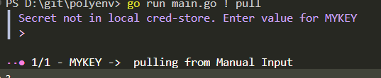

# local vault

saves secrets in local keyring / cred store.

Implemented via [keyring](https://github.com/zalando/go-keyring)

## dependencies

### windows and osx

there should be no dependencies as they have their own credential store.

### Linux and *BSD

please read the follwing taken from <https://github.com/zalando/go-keyring#dependencies>:

>  The Linux and *BSD implementation depends on the Secret Service dbus interface, which is provided by GNOME Keyring.
> 
> It's expected that the default collection login exists in the keyring, because it's the default in most distros. If it doesn't exist, you can create it through the keyring frontend program Seahorse:
>    1. Open seahorse
>    1. Go to File > New > Password Keyring
>    1. Click Continue
>    1. When asked for a name, use: login

if you have any issues with this, please open an issue and we will try to get this sorted out.

## usage

when adding a vault, you can select the local vault.  
when setting the vault, it just saves a service/namespace key to the config file, but by adding a actual value, you store it directly into whatever your local credential storage is.

if you clone a repo that has this option, and you use "pull", its will most likely not be a value that you have set in your local cred store, so naturally you will be prompted to enter a value.

## authentication

local vault does not require any authentication.  
it just saves a key/value pair to your local cred store.

- windows: saves under windows credentials -> generic credentials with persistence to local computer.
  - local computer is current computer with current user. it will not save to other computers or users of same device.
- osx: missing documentation. please open an issue or PR if you know how persistance works and how its stored.
- linux: missing documentation. please open an issue or PR if you know how persistance works and how its stored.

### init

arguments:

- `service|s`: the service name.
- `key|k`: the key to use.
- I will not accept passwords as arguments. its unsafe to do so as it could expose your password to the shell. especially with terminals saving prevously entered commands.. there is honestly no secure way to do this. i will ask you as part of the wizard to enter the value.

## updating secrets

Not supported... yet.  
This will be a part of "push" or "edit" that will release at a later date. you wont be able to update the remote key, but the value will be able to be updated.
for now you can find the cred store and update value manually. next pull vill pull the new value.
